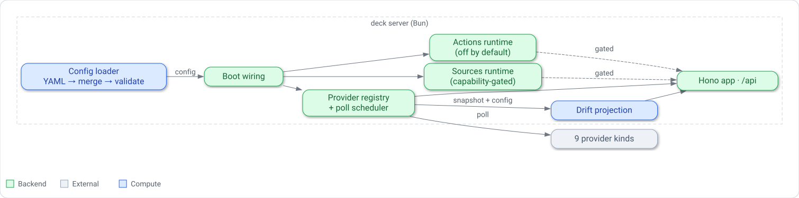

# Building-block view: engine subsystems

## Purpose

This chapter maps the internal subsystems of the deck server and shows how a boot, a poll, and an
API request move through them.
It is the connecting spine for the architecture set: a few features carry their own detailed
building-block notes, and the rest are summarised here so the whole engine stays visible at one
altitude.

## Content

The server is a single Bun process whose subsystems are wired together once, at boot, and then
serve requests from cached state.
The subsystems below are listed in the order boot touches them.

### Config load, merge, and validate

Boot begins by loading estate configuration.
The loader resolves the config directory, reads every `*.yaml` layer in lexical order, and folds
the layers together: it validates the base layer, then for each overlay validates it against the
accumulated document and merges it, and finally validates the merged result.
Merging and the schema logic live in `@deck/schema` (`merge.ts` and `validate/**`); the
server-side orchestration lives in `apps/server/src/config/`.
The outcome is one of three exit classes — clean, findings, or tool error — and boot fails fast on
anything but clean, so the process never serves a document it could not validate.

### Boot wiring

With a trusted config in hand, `boot.ts` plans the modules, registers providers, starts the
modules and the poll scheduler, and builds the Hono app with the config, provider reader and module
host injected as dependencies.
A misconfiguration in any of these steps fails fast with a classified error and a non-zero exit
rather than a half-configured server.

### Provider registry and poll scheduler

Monitoring and inventory data is served through a provider registry
(`apps/server/src/providers/registry.ts`).
`registerAllProviders` translates estate declarations — integrations, host and service bindings,
and declared document sources — and the runtime snapshot source into providers of one of eleven kinds:
`alertmanager`, `docker`, `file-tree`, `gatus`, `http-health`, `http-json`, `link`,
`markdown-tree`, `prometheus`, `remote`, and `snapshot`.
Every kind is owned by a data-source module (`link`, `http-health`, `http-json`, `remote`, `docker`, `gatus`,
`prometheus`, `alertmanager`, `markdown-tree`, `file-tree`, `snapshot`) and handled by that
module's kind handler: the kernel loops over host and service bindings and `integrations[]` /
`sources[]` instances and registers the providers each handler offers, so it names no kind
itself. The `prometheus` module also parses its integration's summary card. The `snapshot` module
owns `DECK_SNAPSHOT_SOURCE` and offers the singleton `snapshot` provider when it is set; each
handler sees the validated estate (read-only) for checks like the snapshot's against declared
hosts.
The scheduler polls each dynamic provider on its own interval, caches the latest envelope with a
freshness state, and isolates failures so one failing provider never stops the others.
A kind its module declares `static` (`link`) is fetched once and never polled.
API reads (`/api/providers`, `/api/providers/:id`, `/api/health`) return cached envelopes and
health without any upstream I/O.

### Drift projection

The snapshot provider's cached generation feeds drift derivation, a library in its own package
(`@deck/drift`, `packages/drift`) that the web runs in the browser. The snapshot payload and
provider envelope types it reads, with the default poll timing, are the wire contract in
`@deck/contract` (`packages/contract`), which the server and web both import, so the web bundle
loads no server code.
`deriveDriftProjection` takes the observed snapshot and an explicit clock and produces an immutable
view: drift findings grouped by host then service, coverage rows per host, waiver state judged
against the clock, and summary counts.
Because the clock is an explicit input and host freshness is judged relative to it, the same
snapshot can read as fresh or stale depending on when it is derived.

### Sources runtime

The sources subsystem (`apps/server/src/sources/**`) browses declared document and config
repositories read-only, with path confinement, git acquisition, and an on-disk cache.
It runs as three built-in modules: the `markdown-tree` and `file-tree` data sources build a store
and a provider for each source of their kind, and the `sources` module serves the browsing routes
over those stores. A source of a kind no running module serves is unknown to the routes.

### Actions runtime

The actions subsystem (`apps/server/src/actions/**`) executes governed actions through an
allowlisted runner, with parameter validation, confirmation, an execution timeout, and an audit
store.
It is off by default: unless `DECK_ACTIONS_ENABLED` is set and the required data directory and
runner manifest are provided, the capability bundle is absent and every action route refuses with
403.

### The Hono app

All of the above is exposed through one Hono application (`apps/server/src/server/app.ts`).
It layers request logging, the config/provider/health GET routes, error and not-found boundaries,
then the metrics route and the modules' routes (sources, actions, llm-usage), and finally — when
a built web bundle is present — the static assets and SPA fallback.

### Request and poll flow

Two flows dominate.
A **poll** runs on a timer: the scheduler calls a provider's `fetch`, stores the resulting
envelope with a derived freshness state, and updates cached health.
A **request** is served from that cached state: an API read returns the cached envelope or derives
a fresh drift projection from the cached snapshot, without touching upstream systems on the request
path.

## Related decisions

- [ADR-001: Run the server and schema from TypeScript source under Bun](./decisions/adr-001-bun-from-source.md)
- [ADR-002: Layered estate config merged into one document](./decisions/adr-002-layered-config.md)
- [ADR-003: Separate declared intent from observed reality](./decisions/adr-003-intent-vs-reality.md)

Per-feature building-block notes exist for three shipped features and go deeper than this chapter:

- [Hosts and services](./hosts-and-services.md)
- [Governed actions](./governed-actions.md)
- [Sources, docs and configs](./sources-docs-and-configs.md)

Other features — drift and coverage, alerts and health, the portal, and the engine core — do not
have their own notes and are summarised in the subsystems above. The portal, inventory, drift and
monitoring are built-in modules with no server code of their own: each module's manifest declares
its pages, nav entries and extensions, and the portal's also owns the `modules.portal` config
section (its schema, layer ownership, group-id rules and service references). The `/metrics`
exposition is the built-in `metrics` module: it owns `DECK_METRICS_ENABLED`, declares `/metrics`
as a root path, and reads the provider registry's poll statistics through its module context.
A built-in declares `dependsOn` on a module whose provider or service it consumes and cannot do
without: drift and inventory depend on `snapshot`. A module that only enriches its view when
another is present (the portal's card status from any kind that declares `status`, monitoring's integration
cards) does not, so switching that source off leaves it running. The dependant is ordered after
its dependencies, and is dropped (MODULE_DEPENDENCY_MISSING) when one is refused at planning:
absent, switched off, or with an unusable manifest. Disabling a module later, when its kind
handler fails during provider registration, does not cascade: its dependants keep running,
degraded.

**Where a built-in module lives.** A co-located built-in is one workspace package,
`modules/<id>/` (`@deck/module-<id>`):

| Path | Holds |
|---|---|
| `schema.json` | its `modules.<id>` config section schema, if it has one |
| `server/` | its server half; `server/module.ts` exports the module the server's static built-in list (`apps/server/src/modules/builtin.ts`) imports |
| `web/` | its web half; `web/index.ts` registers it, and the web app discovers every `modules/*/web/index.ts` |
| `test/server/`, `test/web/` | its unit tests, run by the host app's test suite (`apps/server`, `apps/web`) |

There is no `module.json`: a built-in's manifest is TypeScript (the data half in
`@deck/contract/modules/<id>`, which the web loads too, spread into `server/module.ts`). Only a
runtime module ships its manifest as JSON (`deck-module.json`). The package declares its own
dependencies; it has no build, typecheck or test script of its own, because both halves compile
inside their host app (the web half may import the app's `@/` modules, which runtime modules reach
through `@deck/sdk` instead). Tests that drive the module through the kernel (the module host, the
app, the config pipeline) stay in the host app's `test/`. Built-ins not yet co-located still live
in `apps/server/src/<id>` (or `providers/<kind>`) and `apps/web/src/features/<feature>`.

*Server building blocks: the config loader feeds boot wiring, which registers providers and starts
the poll scheduler that feeds drift projection; the sources and actions runtimes are each
capability-gated, and everything is exposed through the Hono app.*
