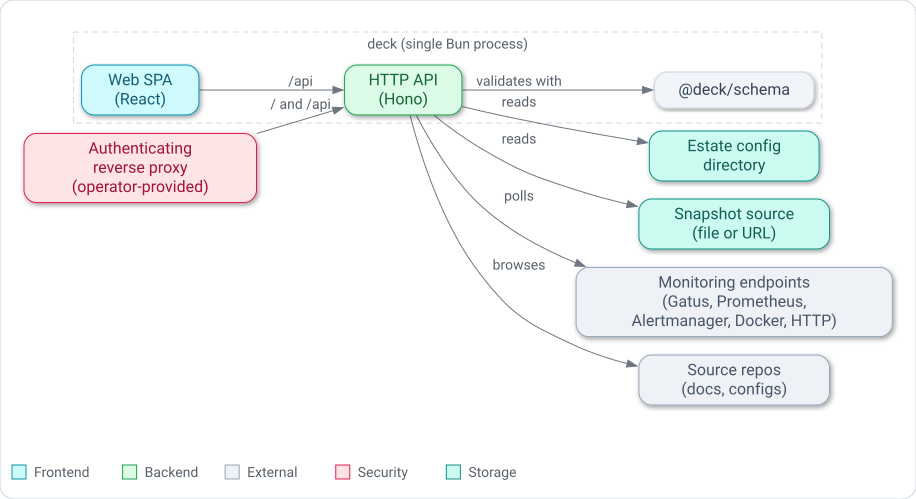

# System context and containers

Deck runs as a single system with a small, easily held set of moving parts.
This view names deck's running containers and the external neighbours it reads from, so a
maintainer can see the whole shape at a glance before descending into any one subsystem.

## The system

Deck is one system: a config-driven hub that presents an estate and the drift between its declared
inventory and observed reality.
It has no persistent database of its own and no built-in identity or authentication.
Access control is expected to sit in front of it, provided by the operator.

## Containers

At runtime deck is a single Bun process.
That process boots from `apps/server/src/server/boot.ts`, builds a Hono application in
`apps/server/src/server/app.ts`, and serves two things from the one port: the `/api` HTTP surface
and, when a built web bundle is present, the static web SPA.

- **Bun server (`@deck/server`).**
  The Hono app exposes the API — `/api/config`, `/api/providers` and `/api/providers/:id`,
  `/api/health`, plus the source-browsing and action routes — and, when `DECK_WEB_DIST` points at a
  built bundle, serves that bundle and falls back to `index.html` for client-side routes.
  It loads and validates estate configuration at boot and fails fast if the configuration cannot be
  trusted.

- **Web SPA (`@deck/web`).**
  A React single-page app, built with Vite into a static bundle.
  It is the only container that is compiled ahead of time; the server serves the built assets and
  the SPA calls the same process's `/api` surface for all data.

- **Schema library (`@deck/schema`).**
  A shared, in-process library, not a separate service.
  It owns the two authoritative JSON Schemas and the validate/merge logic that the server uses to
  turn config layers into one trusted document.

## External neighbours

Everything estate-specific is external to deck and is read, never owned.

- **Estate config directory.**
  A directory of `*.yaml` layers the server reads at boot (via `DECK_CONFIG_DIR`) and merges into
  one canonical document.

- **Snapshot source.**
  The observed-reality document, supplied as a file path or an `http(s)` URL
  (via `DECK_SNAPSHOT_SOURCE`); it feeds the hosts, services, and drift surfaces.

- **Monitoring endpoints.**
  The server polls the estate's monitoring and health backends on a schedule — Gatus, Prometheus,
  Alertmanager, Docker, and plain HTTP health endpoints — through its provider registry, and caches
  each result for the API to read without further upstream I/O.

- **Source repositories.**
  When the sources capability is active, the server browses declared document and config
  repositories read-only to render the docs and configs surfaces.

- **Authenticating reverse proxy.**
  Deck ships no authentication, so an operator-provided reverse proxy is expected to front the
  process and enforce access.
  The proxy is external and operator-specific; deck treats it as a boundary rather than a component
  it configures.

## Packaging note

The container image builds only the web bundle; the server and schema run directly from
TypeScript source under Bun, and one process serves both web and API.
The build and deploy shape is covered in the [deployment view](./deployment.md).

*Deck as one system: a single Bun process serving the web SPA and the API, reading an estate
config directory and a snapshot source, polling monitoring endpoints and browsing source repos,
behind an operator-provided proxy.*

## Related reading

- [Building-block view: engine subsystems](./building-blocks.md) — inside the server process.
- [Deployment view](./deployment.md) — how the containers are packaged and run.
