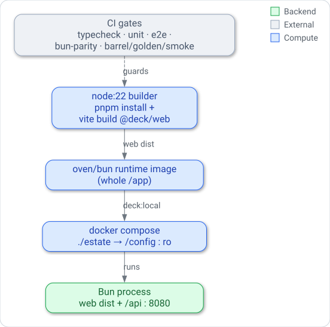

# Deployment view

## Purpose

This chapter describes how deck is packaged and run, for a maintainer who needs the shape of the
build and deployment rather than its line detail.
Deck's runtime story is deliberately small: one image, one process, one mounted estate, fronted
by a proxy the operator brings.
Understanding that shape explains why the Dockerfile has the stages it does, why there is only
one port, and what the CI gates are protecting when they guard a release.

Deployment is self-hosted Docker or Compose.
Each `v*` tag publishes a versioned, multi-arch image to GHCR (`ghcr.io/garygentry/deck`) via the
`release.yml` workflow, and the repository ships a `deploy/compose.prod.yaml` template that pulls
it; building the image from source stays a supported fallback. There is still no
infrastructure-as-code in the repository — the reverse proxy, TLS, and network topology are
operator-provided and sit outside deck's boundary.
This chapter therefore stops at the container and the Compose file, and treats everything in
front of them as an external responsibility.

For the operator-facing procedure, see [Deploy deck](../guides/deploy.md); for the security
posture behind the proxy assumption, see [Access and security model](../security.md).

## Content

### Build shape: two stages, one asset

The image is a multi-stage build with a clean split of responsibility.
The **builder** stage runs on `node:22-alpine`, installs the whole pnpm workspace from the
lockfile, and builds exactly one thing — the web bundle (`pnpm --filter @deck/web build`, Vite
into `apps/web/dist`).
Nothing else is compiled, because the server and `@deck/schema` run directly from TypeScript
source under Bun at runtime; only the browser needs a bundling step.

The **runtime** stage is `oven/bun:1.3.9-alpine`.
It copies the fully installed and built workspace across at the same `/app` path, which preserves
pnpm's `node_modules/.pnpm` symlink store so the server's dependencies and `@deck/schema` resolve
unchanged under Bun.
It sets the container defaults (`DECK_CONFIG_DIR=/config`, `DECK_WEB_DIST=/app/apps/web/dist`,
`DECK_PORT=8080`), exposes `8080`, and declares a `HEALTHCHECK` that polls `/api/health`.

### Runtime shape: one process, one port

At runtime deck is a single Bun process that serves the built web assets and the `/api` surface
together — there is no separate frontend server and no database.
The entrypoint (`docker/entrypoint.sh`) supplies the container defaults and then `exec`s the
server; its one convenience is materializing a now-relative snapshot from a templated estate when
no `DECK_SNAPSHOT_SOURCE` is set, which is for the bundled example, not real deployments.
Because web and API share one process and one port, the deployment topology is just "publish
`DECK_PORT`," and a proxy in front forwards both `/` and `/api` to the same upstream.
Because the server is PID 1, `docker stop`'s SIGTERM reaches it directly, and deck stops in order:
1. It closes the listener. A request that still arrives on a kept-alive connection gets 503
   `SHUTTING_DOWN`.
2. It stops its modules, within 4 s:
   - at once, the `actions` module cancels in-flight action runs (up to 4 s, and never past
     the stage). Each runner's process group gets SIGTERM, then SIGKILL after 1 s, and every
     cancelled run is written to the audit log as `cancelled`. If cancelling outlives its
     bound, deck logs `actions.stop-hook-timeout`; this replaces the earlier
     `server.stop-stage-timeout` event with `stage: "actions"`, which no longer exists;
   - beside that, module by module, scheduled work drains (up to 2 s per module), then each
     stop hook runs (up to 1 s).
3. It stops provider polling.
4. It gives in-flight requests 2.5 s to finish, then closes their connections.

These stages add up to 7 s. A clean stop exits 0. The whole shutdown, including a boot still in
progress when the signal arrives, has a 9 s deadline (inside Docker's default 10 s grace
period); past it deck exits 1. A second SIGTERM or SIGINT exits 1 at once.

State lives outside the image: the estate config is a mounted volume at `/config`, and the
observed snapshot is a mounted file or a fetched URL.
The image is therefore stateless and replaceable — the unit of deployment is "this image plus
that mounted estate."

### Compose topology

[`examples/compose.yaml`](../../examples/compose.yaml) is the reference topology and the smallest
complete deployment: it builds the image, publishes `8080:8080`, mounts `./estate` at
`/config:ro`, and runs under `restart: unless-stopped`.
An operator deploying their own estate copies this file and repoints the config volume; the
authenticating reverse proxy is added in front of it and is not part of the file.

### CI gates that guard a release

The GitHub Actions workflow (`.github/workflows/ci.yml`) is the release gate, and its jobs mirror
the dual Node/Bun nature of the build.
`node-pnpm` runs typecheck plus the schema, server, and web unit tests under Node.
`web-e2e` runs the Playwright suite sharded across runners (the suite is single-worker by design,
so parallelism comes from cross-runner shards).
`bun-parity` re-runs the unit tests under Bun, proving the code that ships in the runtime image
behaves the same on the runtime engine.
`gates` runs the correctness guards: a golden `deck render` comparison and
a bare-Bun boot smoke that boots the server and asserts a well-formed `/api/health` payload.
Together they protect the invariant this deployment depends on — that the same source runs
correctly under Bun and boots to a healthy process.
The server unit tests (run by both `node-pnpm` and `bun-parity`) also include parity goldens
(`apps/server/test/parity-golden.test.ts`). For the frozen v1 example estate and every estate
fixture they pin the `deck validate` and `deck snapshot validate` output. They also pin the API
responses (config, provider list and envelopes, health, actions, LLM usage) against canned
upstreams, and the route table. Refreshing them is an explicit opt-in
(`DECK_UPDATE_GOLDENS=1`), so any behaviour change shows up as a reviewed golden diff.
`kernel-touch` is informational and never fails the build. It lists the kernel files a branch
changes (`scripts/kernel-touch.ts` holds the kernel path list), as a trend to keep near zero for
new modules. On a separate line it lists the parity-gate files touched.

*The build-to-deploy pipeline: a Node builder produces the web bundle, the Bun runtime image
serves web and API from one process on :8080, Compose mounts the estate read-only, and the CI
gates guard the release.*

## Related decisions

The single most load-bearing choice here — running the server and schema from TypeScript source
under Bun and compiling only the web bundle — is recorded in
[ADR-001: Run the server and schema from TypeScript source under Bun](../architecture/decisions/adr-001-bun-from-source.md).
It is what makes the builder stage compile one asset instead of three and lets the runtime image
carry source rather than a server build, and it is why `bun-parity` exists as a distinct gate.
