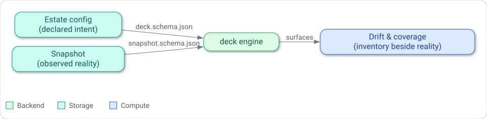

# Engine and estate: the config-driven contract

Deck is a generic hub engine that carries no facts about any particular estate.
It ships no host names, no service inventory, and no monitoring endpoints of its own.
Everything specific to a home lab arrives from outside, as configuration and as an observed
snapshot, and deck's job is to read that material, render it, and reason about the difference
between what was declared and what was seen.
This page explains why the project is built that way and what the arrangement buys and costs.

## Generic engine, projected estate

The clean line between engine and estate is the central design choice.
Deck's code knows the *shapes* of estate facts but not the facts themselves.
Those shapes live in two authoritative JSON Schemas — `deck.schema.json` for declared
configuration and `snapshot.schema.json` for observed reality — and the engine treats them as a
contract it consumes rather than data it owns.

An estate repository projects its own facts into those shapes.
It authors hosts, services, portal groups, monitoring integrations, and document sources as
config that validates against `deck.schema.json`, and it produces a snapshot that validates
against `snapshot.schema.json`.
Deck then reads whatever it is pointed at.
Nothing in the engine assumes a specific network, naming scheme, or toolchain, so the same build
serves any estate that can express itself in the schema.

The payoff is reuse and separation of concerns.
The engine can be developed, tested, and released against fixtures and an example estate without
ever touching a real deployment, and an operator can evolve their estate without waiting on an
engine change.
The cost is indirection: because deck knows nothing until it is configured, an empty or
mis-declared estate produces an empty or wrong-looking deck, and the schema becomes the thing
everyone has to understand.
The engine leans on that contract hard — it validates configuration up front and refuses to boot
on a document it cannot trust, so that a projection error surfaces at load time rather than as a
confusing screen later.

## Layered configuration

Estate configuration is not one file but an ordered set of YAML layers in a directory, merged
into a single canonical document before anything else happens.
Deck reads every `*.yaml` file in the config directory in lexical order, so a conventional
`00-base` file is consumed before a `10-overlay` file, and the earlier layer is the base that
later layers refine.

The reason for layering is that estate facts have two different origins and lifecycles.
A base layer holds inventory — the hosts and services that exist — which often comes from a
generator or an authoritative source of record.
An overlay layer holds presentation and intent — how the portal is arranged, which links appear,
how things are labelled — which a human authors and tunes by hand.
Keeping them in separate layers lets a machine regenerate the base without clobbering the
hand-authored overlay, and the merge rules enforce that split: ownership is assigned per field,
so a value that belongs to the base cannot be silently overridden from an overlay and a
presentation value cannot leak into the base.
The merge is also strict on preconditions — the layers must agree on `schemaVersion`, and entries
that are matched across layers must carry their identity — and it fails the whole load rather than
emit a half-merged document.

The trade-off is conceptual overhead.
A single flat file would be simpler to read at a glance, and layering asks the author to know
which layer a given key belongs in.
Deck accepts that cost because the alternative — regeneration and hand-authoring fighting over one
file — is worse, and because validation can point at the offending layer when a value lands in the
wrong place.

## Intent vs reality

Declared configuration and the observed snapshot are deliberately two documents, not one.
Configuration is *declared intent*: the estate as it is supposed to be.
The snapshot is *observed reality*: the estate as it was actually seen at a moment in time,
produced by whatever observation the operator runs and projected into `snapshot.schema.json`.
Deck never writes estate facts back into either document; it only reads them.

Holding intent and reality apart is what makes drift meaningful.
Because the two are separate inputs, deck can derive the difference between them — a host that was
declared but not observed, a service whose observed state diverges from what was intended — and
present that difference as drift rather than folding it into a single ambiguous view.
The snapshot also carries its own honesty about how completely each host was seen and when it was
collected, so deck can judge coverage and freshness from the reality document without the
configuration having to know anything about observation.

If the two were merged into one document, there would be nothing to compare, and every update
would force a choice between overwriting intent with observation or the reverse.
Keeping them separate costs an operator a second artifact to produce and keep fresh, and it means
a stale snapshot can misrepresent a healthy estate — a real hazard the freshness model exists to
surface.
That cost is the price of being able to show inventory *beside* reality instead of collapsing the
two.

*The two-document model: declared intent and observed reality flow into the engine, which surfaces
drift and coverage from the two documents.*

## Related reading

- [Estate configuration reference](../reference/estate-config.md) — every declared-intent key.
- [Snapshot contract reference](../reference/snapshot-contract.md) — the observed-reality shape.
- [Inventory beside reality: how drift and coverage work](../explanation/drift-and-coverage.md) —
  how the difference is derived and how freshness is judged.
- [Kernel and modules](kernel-and-modules.md) — how the engine itself is built from modules on
  one contract, and how to extend it.
